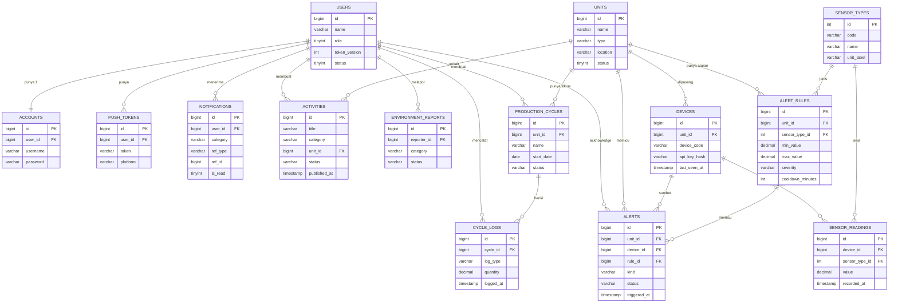
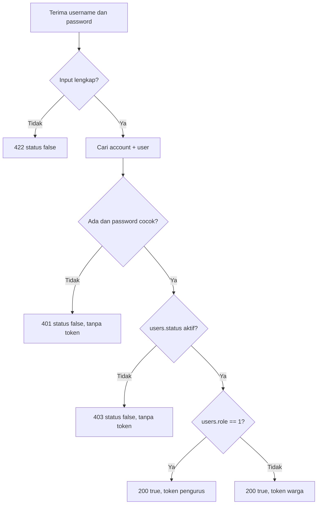
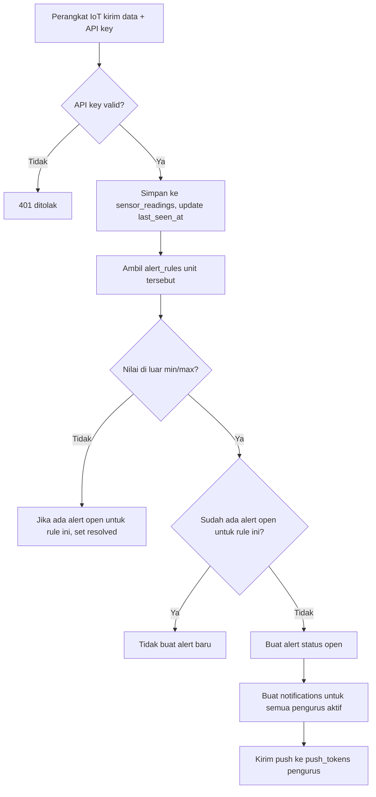
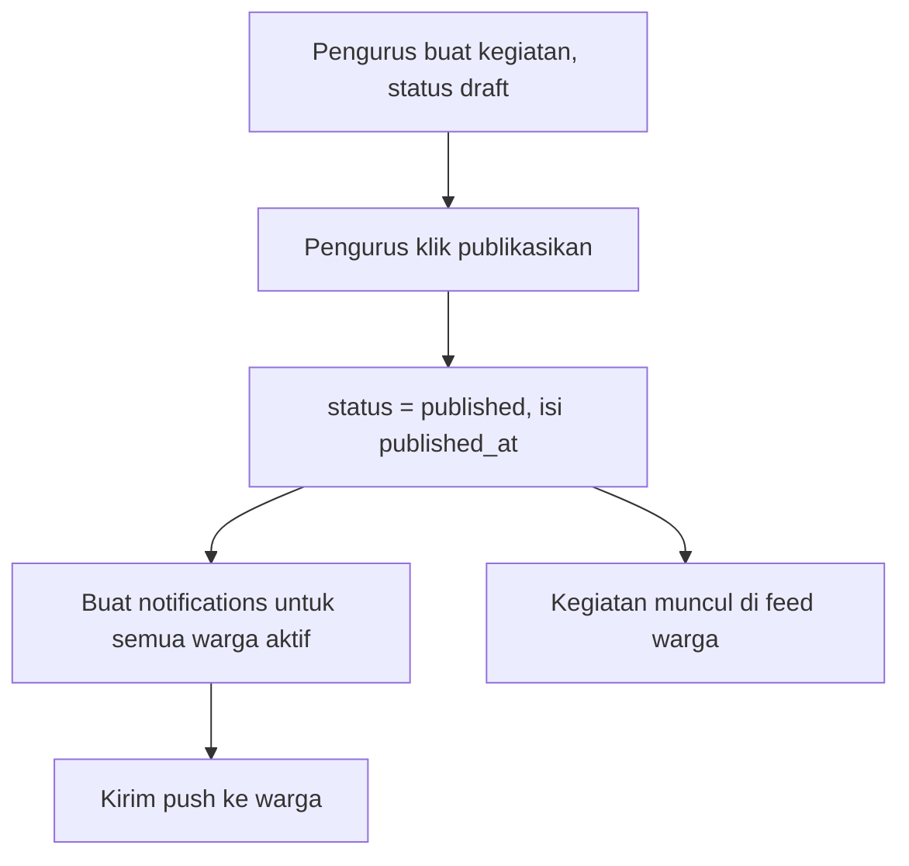
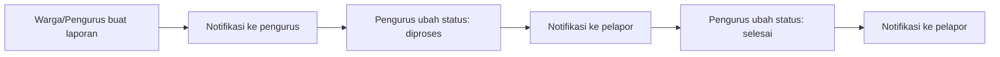

# my23 — Desa Pintar RW & Karang Taruna (PRD, Database, ERD)

Aplikasi desa pintar untuk RW dan Karang Taruna (Karta).
Fase 1 mencakup: **Login, Monitoring IoT (budidaya lele, hidroponik, maggot), Kesehatan Lingkungan, Notifikasi, dan Informasi Kegiatan Karta untuk warga.**

| Item | Isi |
|---|---|
| Versi | 0.2 (draft) |
| Perubahan dari 0.1 | Ditambah modul IoT, budidaya, kesehatan lingkungan, kegiatan Karta, notifikasi |
| Role | Pengurus (1), Warga (2) |

---

## 1. PRD (Product Requirements Document)

### 1.1 Latar Belakang
RW dan Karang Taruna menjalankan beberapa usaha bersama: budidaya lele, hidroponik, dan maggot (olah sampah organik). Pengurus perlu memantau kondisi secara real time dan segera tahu jika ada masalah (misal pH kolam anjlok). Warga perlu mudah mengetahui apa saja yang dikerjakan Karta serta informasi penting lingkungan.

### 1.2 Tujuan
1. Pengurus memantau sensor IoT tiap unit budidaya dan menerima **notifikasi peringatan** saat nilai di luar batas aman.
2. Pengurus mencatat siklus dan aktivitas budidaya (pakan, panen, dll).
3. Pengurus dan warga dapat melaporkan/memantau **kesehatan lingkungan**.
4. Warga dapat melihat **kegiatan Karta** dan menerima **notifikasi informasi** yang memudahkan mereka.

### 1.3 Di Luar Cakupan (fase 1)
Penjualan hasil panen/kas, iuran, registrasi mandiri warga, lupa password, kontrol aktuator IoT (hidup/matikan pompa dari aplikasi), kamera/CCTV, prediksi berbasis AI.

### 1.4 Pengguna dan Hak Akses

| Role | Nilai | Ringkasan akses |
|---|---|---|
| Pengurus | 1 | Kelola semua modul, terima notifikasi peringatan IoT |
| Warga | 2 | Lihat kegiatan Karta, ringkasan hasil, lapor lingkungan, terima notifikasi informasi |
| Perangkat IoT | — | Bukan user. Mengirim data dengan API key perangkat |

**Matriks akses**

| Fitur | Pengurus | Warga |
|---|---|---|
| Login | ✅ | ✅ |
| Kelola unit budidaya & perangkat | ✅ | ❌ |
| Lihat data sensor detail & grafik | ✅ | ❌ |
| Lihat ringkasan unit (status & hasil panen) | ✅ | ✅ (ringkas) |
| Atur batas aman (alert rule) | ✅ | ❌ |
| Terima notifikasi peringatan IoT | ✅ | ❌ |
| Catat siklus & aktivitas budidaya | ✅ | ❌ |
| Kelola kegiatan Karta | ✅ | ❌ |
| Lihat kegiatan Karta (yang dipublikasikan) | ✅ | ✅ |
| Buat laporan lingkungan | ✅ | ✅ |
| Tindak lanjut laporan lingkungan | ✅ | ❌ |
| Terima notifikasi informasi | ✅ | ✅ |

### 1.5 Aturan Bisnis

**Autentikasi**
1. Satu user hanya punya satu account; username unik.
2. Password disimpan sebagai hash.
3. Role 1 login benar → token pengurus. Role 2 login benar → token warga.
4. Username/password salah → gagal, tanpa token. User nonaktif → ditolak.
5. Menaikkan `token_version` membatalkan semua token lama.

**IoT dan peringatan**
6. Setiap perangkat terpasang pada satu unit budidaya (atau unit lingkungan) dan punya API key sendiri.
7. Data sensor diterima dari perangkat, lalu dievaluasi terhadap `alert_rules`.
8. Jika nilai di luar rentang aman, dibuat satu `alert`. Selama alert yang sama masih **open**, tidak dibuat alert baru (mencegah spam). Ada juga jeda minimal antar notifikasi (cooldown).
9. Jika perangkat tidak mengirim data melebihi batas waktu (misal 15 menit), dibuat alert **perangkat offline**.
10. Setiap alert baru menghasilkan notifikasi ke **semua pengurus aktif**.
11. Alert berstatus: `open` → `acknowledged` (sudah dilihat pengurus) → `resolved` (nilai kembali normal atau ditutup manual).

**Budidaya**
12. Satu unit boleh punya banyak siklus, tetapi hanya satu siklus **aktif** pada satu waktu.
13. Aktivitas (pakan, panen, dll) dicatat pada siklus.

**Kegiatan Karta dan notifikasi warga**
14. Kegiatan berstatus `draft` atau `published`. Warga hanya melihat yang `published`.
15. Saat kegiatan dipublikasikan, warga menerima notifikasi informasi.
16. Notifikasi untuk warga tidak boleh berisi data teknis sensor atau peringatan internal.

**Kesehatan lingkungan**
17. Warga dan pengurus dapat membuat laporan (sampah, genangan/jentik, bau/limbah, lainnya).
18. Status laporan: `baru` → `diproses` → `selesai`. Pelapor menerima notifikasi saat status berubah. Pengurus menerima notifikasi untuk laporan baru.

### 1.6 User Stories

| ID | Sebagai | Saya ingin | Agar |
|---|---|---|---|
| US-01 | Pengurus/Warga | login dengan username dan password | masuk sesuai hak akses |
| US-02 | Pengurus | melihat kondisi tiap kolam, bedeng, dan biopond | tahu kondisi terkini |
| US-03 | Pengurus | menerima notifikasi saat sensor di luar batas | segera menangani masalah |
| US-04 | Pengurus | mengatur batas aman tiap sensor | peringatan sesuai kebutuhan |
| US-05 | Pengurus | mencatat pakan, panen, dan siklus | ada riwayat produksi |
| US-06 | Pengurus | mengelola kegiatan Karta | warga tahu apa yang dikerjakan |
| US-07 | Warga | melihat daftar kegiatan Karta | mengetahui program dan hasilnya |
| US-08 | Warga | menerima notifikasi kegiatan dan pengumuman | tidak ketinggalan informasi |
| US-09 | Warga/Pengurus | melapor masalah lingkungan | masalah cepat ditangani |
| US-10 | Pengurus | menandai alert sudah ditangani | ada jejak penanganan |

### 1.7 Kebutuhan Fungsional

| ID | Kebutuhan | Prioritas |
|---|---|---|
| FR-01 | Login dan format respons `status_code`, `status`, `message`, `data` | Wajib |
| FR-02 | CRUD unit budidaya (lele, hidroponik, maggot, lingkungan) | Wajib |
| FR-03 | CRUD perangkat IoT beserta API key | Wajib |
| FR-04 | Endpoint penerima data sensor dari perangkat | Wajib |
| FR-05 | Evaluasi data terhadap aturan, buat alert | Wajib |
| FR-06 | Notifikasi in-app + push ke pengurus saat alert | Wajib |
| FR-07 | Deteksi perangkat offline | Wajib |
| FR-08 | Siklus dan log aktivitas budidaya | Wajib |
| FR-09 | CRUD kegiatan Karta dengan draft/published | Wajib |
| FR-10 | Feed kegiatan dan ringkasan unit untuk warga | Wajib |
| FR-11 | Notifikasi informasi ke warga saat kegiatan dipublikasikan | Wajib |
| FR-12 | Laporan kesehatan lingkungan beserta status | Wajib |
| FR-13 | Daftar notifikasi, tandai dibaca, jumlah belum dibaca | Wajib |
| FR-14 | Grafik riwayat sensor (jam/hari/minggu) | Disarankan |
| FR-15 | Pengaturan preferensi notifikasi per user | Opsional |

### 1.8 Kebutuhan Non-Fungsional
- HTTPS untuk semua komunikasi, termasuk perangkat IoT.
- Password di-hash (bcrypt/argon2). API key perangkat disimpan sebagai hash.
- Data sensor berfrekuensi tinggi: indeks pada `(device_id, sensor_type_id, recorded_at)` dan kebijakan retensi (misal data mentah 90 hari, setelahnya diringkas per jam).
- Notifikasi peringatan sampai ke pengurus dalam hitungan detik sejak data diterima.
- Pesan error login sama untuk username salah dan password salah.

### 1.9 Kriteria Penerimaan (ringkas)

| Skenario | Hasil |
|---|---|
| Login benar role 1 / role 2 | 200, token pengurus / warga |
| Login salah | 401, tanpa token |
| pH kolam di bawah batas bawah | Alert dibuat, semua pengurus dapat notifikasi |
| Nilai tetap di luar batas pada pembacaan berikutnya | Tidak ada alert duplikat |
| Perangkat diam > 15 menit | Alert "perangkat offline" |
| Pengurus publikasikan kegiatan | Semua warga aktif dapat notifikasi, kegiatan muncul di feed warga |
| Warga membuka data sensor detail | 403 |
| Kegiatan draft | Tidak tampil di feed warga |

---

## 2. Desain Database

Modul: **Auth**, **Unit & IoT**, **Budidaya**, **Kegiatan Karta**, **Kesehatan Lingkungan**, **Notifikasi**.

### 2.1 Auth

**users**

| Kolom | Tipe | Constraint | Keterangan |
|---|---|---|---|
| id | BIGINT | PK | |
| name | VARCHAR(100) | NOT NULL | |
| role | TINYINT | NOT NULL, DEFAULT 2 | 1 pengurus, 2 warga |
| token_version | INT | NOT NULL, DEFAULT 0 | |
| status | TINYINT | NOT NULL, DEFAULT 1 | 1 aktif, 0 nonaktif |
| created_at, updated_at | TIMESTAMP | | |

**accounts**

| Kolom | Tipe | Constraint | Keterangan |
|---|---|---|---|
| id | BIGINT | PK | |
| user_id | BIGINT | FK users.id, UNIQUE | 1 user = 1 account |
| username | VARCHAR(50) | UNIQUE, NOT NULL | |
| password | VARCHAR(255) | NOT NULL | hash |
| created_at, updated_at | TIMESTAMP | | |

### 2.2 Unit & IoT

**units** — tempat budidaya/pemantauan (kolam, bedeng, biopond, titik lingkungan)

| Kolom | Tipe | Constraint | Keterangan |
|---|---|---|---|
| id | BIGINT | PK | |
| name | VARCHAR(100) | NOT NULL | misal "Kolam Lele A" |
| type | VARCHAR(20) | NOT NULL | `lele`, `hidroponik`, `maggot`, `lingkungan` |
| location | VARCHAR(150) | | lokasi/deskripsi |
| status | TINYINT | NOT NULL, DEFAULT 1 | 1 aktif, 0 nonaktif |
| created_at, updated_at | TIMESTAMP | | |

**devices** — perangkat IoT (misal ESP32)

| Kolom | Tipe | Constraint | Keterangan |
|---|---|---|---|
| id | BIGINT | PK | |
| unit_id | BIGINT | FK units.id, NOT NULL | |
| device_code | VARCHAR(50) | UNIQUE, NOT NULL | ID perangkat |
| api_key_hash | VARCHAR(255) | NOT NULL | hash API key |
| last_seen_at | TIMESTAMP | NULL | terakhir kirim data |
| status | TINYINT | NOT NULL, DEFAULT 1 | 1 aktif, 0 nonaktif |
| created_at, updated_at | TIMESTAMP | | |

**sensor_types** — master jenis sensor

| Kolom | Tipe | Constraint | Keterangan |
|---|---|---|---|
| id | INT | PK | |
| code | VARCHAR(30) | UNIQUE, NOT NULL | `ph`, `water_temp`, `do`, `ammonia`, `water_level`, `ec`, `tds`, `air_temp`, `humidity`, `gas_nh3` |
| name | VARCHAR(80) | NOT NULL | |
| unit_label | VARCHAR(20) | | `°C`, `mg/L`, `ppm`, `%`, `cm`, `mS/cm` |

**sensor_readings** — data mentah (tabel terbesar)

| Kolom | Tipe | Constraint | Keterangan |
|---|---|---|---|
| id | BIGINT | PK | |
| device_id | BIGINT | FK devices.id, NOT NULL | |
| sensor_type_id | INT | FK sensor_types.id, NOT NULL | |
| value | DECIMAL(10,3) | NOT NULL | |
| recorded_at | TIMESTAMP | NOT NULL | waktu pengukuran |
| | | INDEX (device_id, sensor_type_id, recorded_at) | |

**alert_rules** — batas aman

| Kolom | Tipe | Constraint | Keterangan |
|---|---|---|---|
| id | BIGINT | PK | |
| unit_id | BIGINT | FK units.id, NOT NULL | |
| sensor_type_id | INT | FK sensor_types.id, NOT NULL | |
| min_value | DECIMAL(10,3) | NULL | batas bawah |
| max_value | DECIMAL(10,3) | NULL | batas atas |
| severity | VARCHAR(10) | NOT NULL, DEFAULT 'warning' | `warning`, `critical` |
| cooldown_minutes | INT | NOT NULL, DEFAULT 30 | jeda minimal antar notifikasi |
| is_active | TINYINT | NOT NULL, DEFAULT 1 | |
| | | UNIQUE (unit_id, sensor_type_id) | |

**alerts** — kejadian peringatan

| Kolom | Tipe | Constraint | Keterangan |
|---|---|---|---|
| id | BIGINT | PK | |
| unit_id | BIGINT | FK units.id, NOT NULL | |
| device_id | BIGINT | FK devices.id, NULL | |
| rule_id | BIGINT | FK alert_rules.id, NULL | NULL jika alert offline |
| kind | VARCHAR(20) | NOT NULL | `threshold`, `offline` |
| severity | VARCHAR(10) | NOT NULL | |
| value | DECIMAL(10,3) | NULL | nilai pemicu |
| message | VARCHAR(255) | NOT NULL | |
| status | VARCHAR(15) | NOT NULL, DEFAULT 'open' | `open`, `acknowledged`, `resolved` |
| triggered_at | TIMESTAMP | NOT NULL | |
| acknowledged_by | BIGINT | FK users.id, NULL | |
| acknowledged_at | TIMESTAMP | NULL | |
| resolved_at | TIMESTAMP | NULL | |

### 2.3 Budidaya

**production_cycles** — siklus tiap unit (satu tebar lele, satu tanam hidroponik, satu batch maggot)

| Kolom | Tipe | Constraint | Keterangan |
|---|---|---|---|
| id | BIGINT | PK | |
| unit_id | BIGINT | FK units.id, NOT NULL | |
| name | VARCHAR(100) | NOT NULL | misal "Lele Batch Okt 2026" |
| start_date | DATE | NOT NULL | |
| end_date | DATE | NULL | |
| initial_qty | DECIMAL(12,2) | NULL | jumlah awal (ekor/tanaman/kg telur) |
| status | VARCHAR(15) | NOT NULL, DEFAULT 'active' | `active`, `finished`, `failed` |
| notes | TEXT | NULL | |
| created_by | BIGINT | FK users.id | |
| created_at, updated_at | TIMESTAMP | | |

**cycle_logs** — catatan aktivitas

| Kolom | Tipe | Constraint | Keterangan |
|---|---|---|---|
| id | BIGINT | PK | |
| cycle_id | BIGINT | FK production_cycles.id, NOT NULL | |
| log_type | VARCHAR(20) | NOT NULL | `feeding`, `water_change`, `nutrient`, `waste_input`, `treatment`, `harvest`, `mortality`, `other` |
| quantity | DECIMAL(12,2) | NULL | jumlah |
| quantity_unit | VARCHAR(15) | NULL | `kg`, `ekor`, `liter`, `gram` |
| note | VARCHAR(255) | NULL | |
| logged_at | TIMESTAMP | NOT NULL | |
| logged_by | BIGINT | FK users.id | |

Contoh pemakaian: lele panen = `harvest` 120 kg; maggot = `waste_input` 50 kg lalu `harvest` 8 kg; hidroponik = `nutrient` 2 liter.

### 2.4 Kegiatan Karta

**activities**

| Kolom | Tipe | Constraint | Keterangan |
|---|---|---|---|
| id | BIGINT | PK | |
| title | VARCHAR(150) | NOT NULL | |
| description | TEXT | NULL | |
| category | VARCHAR(30) | NOT NULL | `budidaya`, `lingkungan`, `sosial`, `rapat`, `lainnya` |
| unit_id | BIGINT | FK units.id, NULL | kaitan ke unit (opsional) |
| activity_date | DATETIME | NOT NULL | waktu pelaksanaan |
| location | VARCHAR(150) | NULL | |
| image_url | VARCHAR(255) | NULL | |
| status | VARCHAR(15) | NOT NULL, DEFAULT 'draft' | `draft`, `published` |
| published_at | TIMESTAMP | NULL | |
| created_by | BIGINT | FK users.id | |
| created_at, updated_at | TIMESTAMP | | |

### 2.5 Kesehatan Lingkungan

**environment_reports**

| Kolom | Tipe | Constraint | Keterangan |
|---|---|---|---|
| id | BIGINT | PK | |
| reporter_id | BIGINT | FK users.id, NOT NULL | |
| category | VARCHAR(20) | NOT NULL | `sampah`, `genangan`, `jentik`, `limbah`, `lainnya` |
| description | TEXT | NOT NULL | |
| location | VARCHAR(150) | NOT NULL | |
| photo_url | VARCHAR(255) | NULL | |
| status | VARCHAR(15) | NOT NULL, DEFAULT 'baru' | `baru`, `diproses`, `selesai` |
| handled_by | BIGINT | FK users.id, NULL | |
| handler_note | VARCHAR(255) | NULL | |
| created_at, updated_at | TIMESTAMP | | |

Pemantauan otomatis kualitas lingkungan (misal gas amonia, suhu, kelembapan) memakai unit bertipe `lingkungan` dengan perangkat dan sensor seperti unit lainnya.

### 2.6 Notifikasi

**notifications** — satu baris per penerima

| Kolom | Tipe | Constraint | Keterangan |
|---|---|---|---|
| id | BIGINT | PK | |
| user_id | BIGINT | FK users.id, NOT NULL | penerima |
| category | VARCHAR(20) | NOT NULL | `alert`, `activity`, `report`, `system` |
| title | VARCHAR(120) | NOT NULL | |
| body | VARCHAR(255) | NOT NULL | |
| ref_type | VARCHAR(30) | NULL | `alert`, `activity`, `report` |
| ref_id | BIGINT | NULL | id data terkait |
| is_read | TINYINT | NOT NULL, DEFAULT 0 | |
| read_at | TIMESTAMP | NULL | |
| created_at | TIMESTAMP | | |
| | | INDEX (user_id, is_read, created_at) | |

**push_tokens** — token perangkat HP untuk push notification (misal FCM)

| Kolom | Tipe | Constraint | Keterangan |
|---|---|---|---|
| id | BIGINT | PK | |
| user_id | BIGINT | FK users.id, NOT NULL | |
| token | VARCHAR(255) | UNIQUE, NOT NULL | |
| platform | VARCHAR(10) | NOT NULL | `android`, `ios`, `web` |
| created_at | TIMESTAMP | | |

### 2.7 SQL Inti

```sql
CREATE TABLE users (
  id BIGINT PRIMARY KEY AUTO_INCREMENT,
  name VARCHAR(100) NOT NULL,
  role TINYINT NOT NULL DEFAULT 2 COMMENT '1=pengurus, 2=warga',
  token_version INT NOT NULL DEFAULT 0,
  status TINYINT NOT NULL DEFAULT 1,
  created_at TIMESTAMP DEFAULT CURRENT_TIMESTAMP,
  updated_at TIMESTAMP DEFAULT CURRENT_TIMESTAMP ON UPDATE CURRENT_TIMESTAMP,
  CONSTRAINT chk_role CHECK (role IN (1, 2))
);

CREATE TABLE accounts (
  id BIGINT PRIMARY KEY AUTO_INCREMENT,
  user_id BIGINT NOT NULL UNIQUE,
  username VARCHAR(50) NOT NULL UNIQUE,
  password VARCHAR(255) NOT NULL,
  created_at TIMESTAMP DEFAULT CURRENT_TIMESTAMP,
  updated_at TIMESTAMP DEFAULT CURRENT_TIMESTAMP ON UPDATE CURRENT_TIMESTAMP,
  FOREIGN KEY (user_id) REFERENCES users(id)
);

CREATE TABLE units (
  id BIGINT PRIMARY KEY AUTO_INCREMENT,
  name VARCHAR(100) NOT NULL,
  type VARCHAR(20) NOT NULL,
  location VARCHAR(150),
  status TINYINT NOT NULL DEFAULT 1,
  created_at TIMESTAMP DEFAULT CURRENT_TIMESTAMP,
  updated_at TIMESTAMP DEFAULT CURRENT_TIMESTAMP ON UPDATE CURRENT_TIMESTAMP
);

CREATE TABLE devices (
  id BIGINT PRIMARY KEY AUTO_INCREMENT,
  unit_id BIGINT NOT NULL,
  device_code VARCHAR(50) NOT NULL UNIQUE,
  api_key_hash VARCHAR(255) NOT NULL,
  last_seen_at TIMESTAMP NULL,
  status TINYINT NOT NULL DEFAULT 1,
  created_at TIMESTAMP DEFAULT CURRENT_TIMESTAMP,
  updated_at TIMESTAMP DEFAULT CURRENT_TIMESTAMP ON UPDATE CURRENT_TIMESTAMP,
  FOREIGN KEY (unit_id) REFERENCES units(id)
);

CREATE TABLE sensor_types (
  id INT PRIMARY KEY AUTO_INCREMENT,
  code VARCHAR(30) NOT NULL UNIQUE,
  name VARCHAR(80) NOT NULL,
  unit_label VARCHAR(20)
);

CREATE TABLE sensor_readings (
  id BIGINT PRIMARY KEY AUTO_INCREMENT,
  device_id BIGINT NOT NULL,
  sensor_type_id INT NOT NULL,
  value DECIMAL(10,3) NOT NULL,
  recorded_at TIMESTAMP NOT NULL,
  FOREIGN KEY (device_id) REFERENCES devices(id),
  FOREIGN KEY (sensor_type_id) REFERENCES sensor_types(id),
  INDEX idx_reading (device_id, sensor_type_id, recorded_at)
);

CREATE TABLE alert_rules (
  id BIGINT PRIMARY KEY AUTO_INCREMENT,
  unit_id BIGINT NOT NULL,
  sensor_type_id INT NOT NULL,
  min_value DECIMAL(10,3) NULL,
  max_value DECIMAL(10,3) NULL,
  severity VARCHAR(10) NOT NULL DEFAULT 'warning',
  cooldown_minutes INT NOT NULL DEFAULT 30,
  is_active TINYINT NOT NULL DEFAULT 1,
  UNIQUE (unit_id, sensor_type_id),
  FOREIGN KEY (unit_id) REFERENCES units(id),
  FOREIGN KEY (sensor_type_id) REFERENCES sensor_types(id)
);

CREATE TABLE alerts (
  id BIGINT PRIMARY KEY AUTO_INCREMENT,
  unit_id BIGINT NOT NULL,
  device_id BIGINT NULL,
  rule_id BIGINT NULL,
  kind VARCHAR(20) NOT NULL,
  severity VARCHAR(10) NOT NULL,
  value DECIMAL(10,3) NULL,
  message VARCHAR(255) NOT NULL,
  status VARCHAR(15) NOT NULL DEFAULT 'open',
  triggered_at TIMESTAMP NOT NULL,
  acknowledged_by BIGINT NULL,
  acknowledged_at TIMESTAMP NULL,
  resolved_at TIMESTAMP NULL,
  FOREIGN KEY (unit_id) REFERENCES units(id),
  FOREIGN KEY (device_id) REFERENCES devices(id),
  FOREIGN KEY (rule_id) REFERENCES alert_rules(id),
  FOREIGN KEY (acknowledged_by) REFERENCES users(id)
);

CREATE TABLE production_cycles (
  id BIGINT PRIMARY KEY AUTO_INCREMENT,
  unit_id BIGINT NOT NULL,
  name VARCHAR(100) NOT NULL,
  start_date DATE NOT NULL,
  end_date DATE NULL,
  initial_qty DECIMAL(12,2) NULL,
  status VARCHAR(15) NOT NULL DEFAULT 'active',
  notes TEXT NULL,
  created_by BIGINT NOT NULL,
  created_at TIMESTAMP DEFAULT CURRENT_TIMESTAMP,
  updated_at TIMESTAMP DEFAULT CURRENT_TIMESTAMP ON UPDATE CURRENT_TIMESTAMP,
  FOREIGN KEY (unit_id) REFERENCES units(id),
  FOREIGN KEY (created_by) REFERENCES users(id)
);

CREATE TABLE cycle_logs (
  id BIGINT PRIMARY KEY AUTO_INCREMENT,
  cycle_id BIGINT NOT NULL,
  log_type VARCHAR(20) NOT NULL,
  quantity DECIMAL(12,2) NULL,
  quantity_unit VARCHAR(15) NULL,
  note VARCHAR(255) NULL,
  logged_at TIMESTAMP NOT NULL,
  logged_by BIGINT NOT NULL,
  FOREIGN KEY (cycle_id) REFERENCES production_cycles(id),
  FOREIGN KEY (logged_by) REFERENCES users(id)
);

CREATE TABLE activities (
  id BIGINT PRIMARY KEY AUTO_INCREMENT,
  title VARCHAR(150) NOT NULL,
  description TEXT NULL,
  category VARCHAR(30) NOT NULL,
  unit_id BIGINT NULL,
  activity_date DATETIME NOT NULL,
  location VARCHAR(150) NULL,
  image_url VARCHAR(255) NULL,
  status VARCHAR(15) NOT NULL DEFAULT 'draft',
  published_at TIMESTAMP NULL,
  created_by BIGINT NOT NULL,
  created_at TIMESTAMP DEFAULT CURRENT_TIMESTAMP,
  updated_at TIMESTAMP DEFAULT CURRENT_TIMESTAMP ON UPDATE CURRENT_TIMESTAMP,
  FOREIGN KEY (unit_id) REFERENCES units(id),
  FOREIGN KEY (created_by) REFERENCES users(id)
);

CREATE TABLE environment_reports (
  id BIGINT PRIMARY KEY AUTO_INCREMENT,
  reporter_id BIGINT NOT NULL,
  category VARCHAR(20) NOT NULL,
  description TEXT NOT NULL,
  location VARCHAR(150) NOT NULL,
  photo_url VARCHAR(255) NULL,
  status VARCHAR(15) NOT NULL DEFAULT 'baru',
  handled_by BIGINT NULL,
  handler_note VARCHAR(255) NULL,
  created_at TIMESTAMP DEFAULT CURRENT_TIMESTAMP,
  updated_at TIMESTAMP DEFAULT CURRENT_TIMESTAMP ON UPDATE CURRENT_TIMESTAMP,
  FOREIGN KEY (reporter_id) REFERENCES users(id),
  FOREIGN KEY (handled_by) REFERENCES users(id)
);

CREATE TABLE notifications (
  id BIGINT PRIMARY KEY AUTO_INCREMENT,
  user_id BIGINT NOT NULL,
  category VARCHAR(20) NOT NULL,
  title VARCHAR(120) NOT NULL,
  body VARCHAR(255) NOT NULL,
  ref_type VARCHAR(30) NULL,
  ref_id BIGINT NULL,
  is_read TINYINT NOT NULL DEFAULT 0,
  read_at TIMESTAMP NULL,
  created_at TIMESTAMP DEFAULT CURRENT_TIMESTAMP,
  FOREIGN KEY (user_id) REFERENCES users(id),
  INDEX idx_notif (user_id, is_read, created_at)
);

CREATE TABLE push_tokens (
  id BIGINT PRIMARY KEY AUTO_INCREMENT,
  user_id BIGINT NOT NULL,
  token VARCHAR(255) NOT NULL UNIQUE,
  platform VARCHAR(10) NOT NULL,
  created_at TIMESTAMP DEFAULT CURRENT_TIMESTAMP,
  FOREIGN KEY (user_id) REFERENCES users(id)
);
```

### 2.8 Contoh Data Awal (seed)

**sensor_types**

| code | name | unit_label |
|---|---|---|
| ph | pH | pH |
| water_temp | Suhu Air | °C |
| do | Oksigen Terlarut | mg/L |
| ammonia | Amonia Air | mg/L |
| water_level | Tinggi Air | cm |
| ec | EC Larutan | mS/cm |
| tds | TDS | ppm |
| air_temp | Suhu Udara | °C |
| humidity | Kelembapan | % |
| gas_nh3 | Gas Amonia | ppm |

**Saran batas aman awal** (silakan sesuaikan dengan kondisi lapangan)

| Unit | Sensor | Min | Max |
|---|---|---|---|
| Lele | pH | 6.5 | 8.5 |
| Lele | Suhu air | 25 | 32 |
| Lele | Oksigen terlarut | 3 | — |
| Hidroponik | pH larutan | 5.5 | 6.5 |
| Hidroponik | EC | 1.2 | 2.5 |
| Maggot | Suhu | 25 | 35 |
| Maggot | Kelembapan | 60 | 80 |

---

## 3. ERD



---

## 4. Alur Utama

### 4.1 Login



### 4.2 Data Sensor sampai Notifikasi Pengurus



Pekerjaan terjadwal (cron, tiap 5 menit): cari `devices` dengan `last_seen_at` lebih lama dari batas offline, buat alert `offline` bila belum ada yang open, lalu notifikasi pengurus.

### 4.3 Kegiatan Karta sampai Notifikasi Warga



### 4.4 Laporan Lingkungan



---

## 5. Spesifikasi API

Semua respons memakai format:

```json
{ "status_code": 200, "status": true, "message": "...", "data": {} }
```

### 5.1 Auth

| Method | Endpoint | Akses | Keterangan |
|---|---|---|---|
| POST | `/api/auth/login` | Publik | Login, mengembalikan token pengurus/warga |

**Request**
```json
{ "username": "budi", "password": "rahasia123" }
```

**Berhasil (pengurus)**
```json
{
  "status_code": 200,
  "status": true,
  "message": "Login berhasil",
  "data": { "token": "eyJhbGciOi...", "role": "pengurus", "user": { "id": 1, "name": "Budi" } }
}
```

**Berhasil (warga)** sama, dengan `"role": "warga"`.

**Gagal**
```json
{ "status_code": 401, "status": false, "message": "Username atau password salah", "data": null }
```

**Akun nonaktif**
```json
{ "status_code": 403, "status": false, "message": "Akun tidak aktif", "data": null }
```

### 5.2 IoT (autentikasi: header `X-Device-Key`)

| Method | Endpoint | Keterangan |
|---|---|---|
| POST | `/api/iot/readings` | Perangkat mengirim data sensor |

**Request**
```json
{
  "device_code": "LELE-A-01",
  "recorded_at": "2026-10-01T08:30:00Z",
  "readings": [
    { "sensor": "ph", "value": 6.2 },
    { "sensor": "water_temp", "value": 28.4 },
    { "sensor": "do", "value": 4.1 }
  ]
}
```

### 5.3 Pengurus (token pengurus)

| Method | Endpoint | Keterangan |
|---|---|---|
| GET/POST/PUT | `/api/units` | Kelola unit |
| GET/POST/PUT | `/api/devices` | Kelola perangkat |
| GET | `/api/units/{id}/readings?sensor=ph&range=24h` | Riwayat sensor untuk grafik |
| GET | `/api/units/{id}/latest` | Nilai terakhir tiap sensor |
| GET/PUT | `/api/units/{id}/alert-rules` | Lihat/ubah batas aman |
| GET | `/api/alerts?status=open` | Daftar alert |
| PATCH | `/api/alerts/{id}/acknowledge` | Tandai sudah dilihat |
| PATCH | `/api/alerts/{id}/resolve` | Tutup alert manual |
| GET/POST/PUT | `/api/cycles` | Kelola siklus |
| POST | `/api/cycles/{id}/logs` | Catat aktivitas/panen |
| GET/POST/PUT/DELETE | `/api/activities` | Kelola kegiatan Karta |
| PATCH | `/api/activities/{id}/publish` | Publikasikan kegiatan |
| GET | `/api/environment-reports` | Semua laporan |
| PATCH | `/api/environment-reports/{id}/status` | Ubah status laporan |

### 5.4 Warga (token warga)

| Method | Endpoint | Keterangan |
|---|---|---|
| GET | `/api/public/activities` | Feed kegiatan Karta (published saja) |
| GET | `/api/public/activities/{id}` | Detail kegiatan |
| GET | `/api/public/units` | Ringkasan unit: nama, jenis, status, hasil panen terakhir (tanpa data sensor teknis) |
| POST | `/api/environment-reports` | Buat laporan lingkungan |
| GET | `/api/environment-reports/mine` | Laporan milik sendiri |

### 5.5 Umum (pengurus dan warga)

| Method | Endpoint | Keterangan |
|---|---|---|
| GET | `/api/notifications?unread=1` | Daftar notifikasi milik sendiri |
| GET | `/api/notifications/unread-count` | Jumlah belum dibaca |
| PATCH | `/api/notifications/{id}/read` | Tandai dibaca |
| PATCH | `/api/notifications/read-all` | Tandai semua dibaca |
| POST | `/api/push-tokens` | Daftarkan token push perangkat |

### 5.6 Payload Token (JWT)

| Klaim | Isi |
|---|---|
| sub | `users.id` |
| role | `pengurus` atau `warga` |
| token_version | `users.token_version` saat login |
| exp | Waktu kedaluwarsa (misal 1 hari) |

---

## 6. Contoh Teks Notifikasi

**Ke pengurus (alert)**
- Judul: "Peringatan: pH Kolam Lele A rendah"
- Isi: "pH terukur 5.9, batas aman 6.5 – 8.5. Segera dicek."

**Ke pengurus (offline)**
- Judul: "Perangkat offline"
- Isi: "LELE-A-01 tidak mengirim data sejak 08:15."

**Ke pengurus (laporan)**
- Judul: "Laporan lingkungan baru"
- Isi: "Genangan air di Gang Mawar, dilaporkan oleh Siti."

**Ke warga (kegiatan)**
- Judul: "Kerja bakti & panen lele Sabtu ini"
- Isi: "Karta mengadakan panen lele, Sabtu 08.00 di lokasi kolam. Warga boleh ikut."

**Ke pelapor**
- Judul: "Laporan kamu sedang diproses"
- Isi: "Laporan genangan di Gang Mawar sedang ditangani pengurus."

---

## 7. Tahapan Pengembangan

| Tahap | Isi |
|---|---|
| 1 | Auth: users, accounts, login, middleware role |
| 2 | Master: units, devices, sensor_types, seeder |
| 3 | Endpoint IoT, simpan data, alert rules, alerts |
| 4 | Notifikasi in-app, lalu push (FCM) |
| 5 | Siklus dan log budidaya |
| 6 | Kegiatan Karta dan feed warga |
| 7 | Laporan kesehatan lingkungan |
| 8 | Grafik, retensi data sensor, penyempurnaan |

## 8. Hal yang Perlu Dikonfirmasi

1. Definisi "kesehatan lingkungan": dokumen ini mengasumsikan **pemantauan sensor lingkungan + laporan warga** (sampah, genangan, jentik, limbah). Sesuaikan jika maksudnya lain.
2. Perangkat IoT yang dipakai (ESP32/Arduino) dan cara kirim data (HTTP atau MQTT).
3. Stack backend dan aplikasi klien (web, Android, atau keduanya).
4. Seberapa detail data yang boleh dilihat warga untuk tiap unit.
